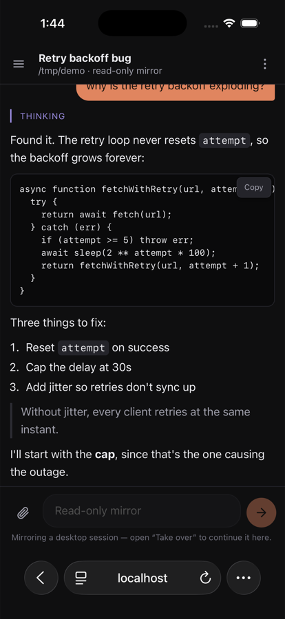

<div align="center">


# Claude Remote Control

[](https://github.com/NspxMiguel/claude-remote-control/actions/workflows/test.yml)
[](#requirements)
[](#install-it-on-your-phone)
[](#reaching-it-from-anywhere)
[](LICENSE)

**Your coding agent, in your pocket — anywhere in the world.**

A daemon runs on your computer. A PWA runs on your phone. Together they turn
Claude Code into a chat app that can actually touch your files, run your
commands, and ask your permission before it does.



</div>

---

## What it does

| | |
|---|---|
| **Chat, properly** | Real streaming output with the same `CLAUDE.md`, settings, MCP servers and skills your desktop uses. Not a wrapper around a chat API — it is your Claude Code, on your machine, with your files. |
| **Reads like the desktop app** | A run of tool calls collapses into one row — *Edited 3 files, ran grep -n  +24 −3* — that expands into the individual calls, each with its command, diff and output. The diffstat comes from the agent's own patch data, so it is exact. |
| **Approval from the couch** | When the agent wants to run something, the request lands on your phone with a chime. Allow once, always allow, or deny. An unanswered prompt is denied after ten minutes rather than hanging forever. |
| **Your desktop sessions, on your phone** | Conversations you started in Claude Desktop or the `claude` CLI show up and update live, because both write the same JSONL transcripts. Type into one and this Mac carries it on — same conversation, same transcript, so it is still there when you reopen it on the Mac. |
| **Photos and screenshots** | Attach from the camera or gallery, or paste one on desktop. Images are downscaled in the browser before upload, so a 12 MB photo crosses the network as a couple hundred KB. An agent with no native image support gets the file written beside the project and named in the prompt, so attaching works everywhere. |
| **Sign an agent in from the phone** | Settings lists every agent, whether it is ready, and the exact command that signs it in. If you cannot reach a terminal, paste an API key instead — it is stored mode-600 next to the master token and exported to that agent only. It never comes back out over the API. |
| **More than one agent** | Claude Code is the one this is built around. Antigravity works through its headless stream. The UI adapts to what each one can actually do. |
| **Keeps the Mac up while you are out** | Two switches in Settings. *Keep this Mac awake* holds a `caffeinate -s`, which prevents idle sleep on mains power. *Run with the lid closed* flips `pmset -a disablesleep`, the only thing that survives shutting the lid, and the daemon clears it the moment you unplug — this is what Amphetamine's Power Protect installs a privileged helper for. |
| **Nothing in the middle** | No cloud, no relay, no account. The daemon talks to your phone over your LAN or your tailnet, and the code that runs is the code in this repo. |

## Why

Claude Code is excellent and it is stuck at your desk. The obvious fixes are all
worse than the problem: SSH into your Mac and squint at a terminal on a 6-inch
screen, or hand your repository to some cloud agent and hope.

This takes the third option. The agent stays exactly where it is — same machine,
same credentials, same project — and only the *interface* moves. What travels
over the network is a transcript and your yes-or-no on a permission prompt.

## Requirements

| | |
|---|---|
| **Node.js 20+** | The daemon. No build step, three dependencies. |
| **A signed-in agent** | Settings ▸ Agents ▸ **Sign in** runs the browser login from the phone. The daemon launches Claude Code under your own account, so it needs credentials on the machine — being signed into the Claude Desktop app is **not** enough. Pasting an API key works too. |
| **Tailscale** | Optional. Without it you get LAN addresses, which are fine at home. With it, your phone reaches your machine from anywhere. |

Not sure? Ask:

```bash
npx crc doctor          # checks Node, the agent, credentials, the port and Tailscale
```

## Install on macOS

```bash
brew tap NspxMiguel/tap                     # adds my tap to Homebrew
brew install --cask claude-remote-control   # builds the app on your machine
```

The cask downloads the source and compiles it where you install it, so nothing
arrives quarantined and Gatekeeper has nothing to object to. It needs the Xcode
Command Line Tools (free); if they are missing it starts that download and waits.
A few minutes, most of it `npm install`.

Open it afterwards and a `>_` appears in the menu bar: start and stop the daemon,
copy an address, show the pairing QR code, and fix whatever `crc doctor` is
complaining about without opening a terminal — see [`mac/`](mac/).

First launch starts the daemon and adds a login item, so the thing you drive from
your phone is running before you reach for your phone. Both are switches in the
panel if you would rather they weren't.

## Quick start

```bash
git clone https://github.com/NspxMiguel/claude-remote-control.git   # get the source
cd claude-remote-control                                            # …
npm install                                                         # three deps, no build
npm start                                                           # prints a QR code
```

The daemon prints a pairing QR and every address it can be reached on:

```
  Open on your phone:

  █▀▀▀▀▀█ ▀▄█ ▄▀ █▀▀▀▀▀█
  █ ███ █ █▄▀█▀▄ █ ███ █
  ...

  http://your-mac.tail1234.ts.net:8787   (Tailscale — anywhere)
  http://192.168.1.20:8787               (LAN via en0)
```

Scan it. That is the whole setup.

### Pairing, three ways

| | |
|---|---|
| **Scan** | The pairing screen has a scanner. It uses the browser's own decoder where there is one and its own where there is not — WebKit has no `BarcodeDetector`, so iPhones get [`web/qr-decode.js`](web/qr-decode.js). On plain HTTP the live camera is blocked (secure contexts only), so the button takes a photo instead and decodes that. Same result, one extra tap. |
| **Six digits** | Click `>_` in the menu bar ▸ **Show pairing code**. It is the biggest thing in the panel, and it lasts ten minutes. No terminal, no 43-character token. |
| **The QR** | Under the code, or from `crc pair`. Your phone's camera app opens it and pairs in one step, because the link carries the token. |

### Install it on your phone

Pair, and the app offers to install itself with the steps for the browser you
are actually holding. Or do it yourself: **iOS** Share ▸ Add to Home Screen,
**Android** ⋮ ▸ Install app.

It installs on a desktop too, from the address bar. The same page becomes a
proper desktop panel with a session sidebar above 900px.

### When the address stops working

Addresses go stale: Tailscale is off on the phone, or you walked out of the
house, or the Mac is asleep. The shell still opens from the service worker's
cache, so instead of a page that never loads you get a screen naming every
other address this Mac answered on, with the token carried across so the new
one is paired on arrival.

The tailnet addresses say so, because "not connected to Tailscale" and "Mac is
off" look identical from a phone otherwise.

### Everyday commands

| Command | What it does |
| --- | --- |
| `crc start` | Run the daemon (default) |
| `crc doctor` | Check everything the daemon needs and print the fix for what is missing |
| `crc pair` | Print a fresh pairing QR code |
| `crc status` | Addresses, Tailscale state, paired devices |
| `crc token --rotate` | New master token; revokes every paired device |
| `crc devices --revoke <id>` | Kick one lost phone |

## Reaching it from anywhere

Install [Tailscale](https://tailscale.com/) on your computer and your phone,
sign both into the same tailnet, and the daemon detects it:

```bash
tailscale up                                            # your machine joins your tailnet
```

Nothing is exposed to the public internet — a tailnet is a private network, and
the daemon still demands a token on top of it. No port forwarding, no dynamic
DNS, no reverse proxy.

### HTTPS, if you want system notifications

Browsers only allow the Notification API on secure origins, so over plain HTTP
you get a chime and a tab badge instead of a real notification. Tailscale can
put a valid certificate in front of the daemon:

```bash
tailscale serve --bg 8787                               # https://your-machine.tail1234.ts.net
```

Notifications, the clipboard API and PWA installation all behave properly there.

## Agents

Claude Code is the agent this is designed around; the others are supported
through whatever interface they actually expose, which is not the same for each.

| Agent | How it connects | Streaming | Remote approval | Notes |
| --- | --- | --- | --- | --- |
| **Claude Code** | Agent SDK | token-level | yes | Full support. Models, interrupt, images, resume. |
| **Antigravity** | `agy -p --output-format stream-json` | chunked | **no** | Its headless stream is one-way, and it asks for approval *on the host* — with nobody at that terminal every tool is denied. Verified against agy 1.1.9: pick **Bypass all** for a remote Antigravity session, or it will read nothing and write nothing. |

The UI only offers agents that are installed, and says up front what a given one
cannot do rather than showing buttons that quietly fail.

> Antigravity has been run end to end against the real binary (agy 1.1.9),
> including tool calls and an image sent from a phone.
> but has not been run against the real `agent` binary — if you hit a mismatch,
> that is where to look first.

## Security

You are handing a device the ability to run commands as you. Treat the token
like an SSH key.

| | |
|---|---|
| **Every request needs a token** | The master token lives in `~/.claude-remote-control/config.json`, mode `600`. Phones get their own device tokens at pairing time. |
| **Agent keys sit beside it** | A key you paste into Settings is stored in that same file and exported only to that agent's process. The API reports whether one is set and a masked hint (`sk-ant-a…FEED`), never the key. Prefer signing in on the host when you can — that keeps the credential in the agent's own keychain instead. |
| **Devices are revocable, not sandboxed** | A paired device can run commands as you, so it can also read that config. Per-device tokens exist so you can revoke one without rotating everything — hygiene, not containment. Pair only devices you'd hand your unlocked laptop to. |
| **Sessions are confined** | To `allowedRoots` — your home directory by default. Traversal out of them is refused, and so are symlinks pointing outside. |
| **Brute force is throttled** | Ten bad tokens from one address locks it out for five minutes. |
| **You choose the permission mode** | `default` routes every prompt to your phone. `bypassPermissions` asks nothing — only use it somewhere you'd be comfortable running `rm -rf` unattended. |

Per session that is a dropdown; for good, it is *Settings ▸ Permissions ▸ Never
ask for permission*. That switch sets the default for new sessions **and**
flips the ones already open, releasing any prompt currently on screen — a
setting that only applied to sessions you had not started yet would be a strange
kind of "stop asking me".

It is enforced in the daemon rather than passed along to the agent, which
matters because the agents disagree about permissions: Claude Code honours the
mode itself, an ACP agent asks anyway, and Antigravity asks on the host where
your phone cannot answer. One switch, one place, all three.

There is **no TLS** unless you put Tailscale in front of it. Over a tailnet the
tunnel is already encrypted end to end. On a home LAN, traffic is in the clear —
fine for most people, not fine on coffee-shop Wi-Fi.

Lost a phone:

```bash
npx crc token --rotate                                  # new master token, every device revoked
```

## Keeping the Mac awake

Two different things sleep a laptop, and they need two different answers.

| | |
|---|---|
| **Idle sleep** | Nothing happening for a while. `caffeinate -s` prevents it, and only while plugged in — on battery the Mac still sleeps. No privileges needed, so *Keep this Mac awake* just works, and the process dies with the daemon so it cannot leave your Mac awake forever. |
| **Lid sleep** | Closing the lid. `caffeinate` does not touch this; only `pmset disablesleep 1` does, and that needs root. This is exactly why Power Protect for Amphetamine ships a privileged helper — open its installer and you find the same two pieces used here: a sudoers rule and a script that shells out to `pmset`. |

Rather than install a helper daemon, run this once:

```bash
./scripts/allow-lid-control.sh                          # asks for your password, once
```

It installs a single sudoers rule granting two commands and nothing else:

```
pmset -a disablesleep 1     # lid-closed mode on
pmset -a disablesleep 0     # off
```

The arguments are fixed — no wildcard — so the rule cannot run `pmset` with any
other setting, let alone another program. The worst it permits is stopping your
Mac from sleeping, which is the point. The script validates the rule with
`visudo -c` before installing it, because a malformed sudoers file locks you out
of `sudo` entirely.

`-a` and not `-c`, because `SleepDisabled` is a single global flag — it never
appears under *AC Power* or *Battery Power* in `pmset -g custom`. "Only while
plugged in" is therefore something pmset cannot promise, so the daemon does it:
while the switch is on it watches the power source and clears the flag within
30 seconds of the plug coming out, then sets it again when power is back. It
also clears the flag when it shuts down, so a Mac that never sleeps can never
outlive the thing that asked for it.

After that, *Run with the lid closed* toggles from the phone. Undo it with
`sudo rm /etc/sudoers.d/claude-remote-control`.

## How it works

```
  phone (PWA)                       your machine
  ┌────────────┐    WebSocket     ┌──────────────────────────────────┐
  │  chat UI   │◀────────────────▶│  daemon                          │
  │  approvals │    REST + WS     │   ├─ driver ─▶ Claude Code / ACP  │
  └────────────┘                  │   └─ tail ~/.claude/projects     │
        ▲                         └──────────────────────────────────┘
        └── Tailscale or LAN                    │
                                    Claude Desktop / CLI write
                                    their transcripts here
```

Two ways in:

1. **Sessions it drives.** A driver launches the agent and holds the
   conversation open, streaming output to your phone and parking each permission
   request until you answer it. Drivers are interchangeable — see
   [`src/agent/drivers/README.md`](src/agent/drivers/README.md).
2. **Sessions it watches.** Claude Desktop and the CLI already write JSONL
   transcripts to `~/.claude/projects`. The daemon tails them, so anything you
   start at your desk appears on your phone within a second.

Feed items carry a monotonic sequence number, so a phone that drops off the
network resumes with `?since=<seq>` instead of refetching the conversation.

## Configuration

`~/.claude-remote-control/config.json`:

```jsonc
{
  "port": 8787,
  "host": "0.0.0.0",              // 127.0.0.1 = local only
  "token": "…",                   // master token
  "devices": [],                  // paired phones
  "allowedRoots": ["/Users/you"], // sessions cannot escape these
  "defaultCwd": "/Users/you/code",
  "defaultModel": "sonnet",
  "defaultPermissionMode": "default",
  "permissionTimeoutSec": 600,    // unanswered prompts are denied after this
  "maxFeedItems": 2000,
  "maxSessions": 8,               // each one is an agent process
  "disallowedTools": ["AskUserQuestion"],
  "credentials": {},              // set from Settings ▸ Agents, never by hand
  "claudeExecutable": null,       // set if the binary lives somewhere unusual
  "antigravityExecutable": null
}
```

`CRC_PORT`, `CRC_HOST` and `CRC_TOKEN` override the file, which is handy in a
service definition.

## Keeping it running

| System | File |
| --- | --- |
| macOS | [`scripts/com.claude.remotecontrol.plist`](scripts/com.claude.remotecontrol.plist) → `~/Library/LaunchAgents` |
| Linux | [`scripts/claude-remote-control.service`](scripts/claude-remote-control.service) → `~/.config/systemd/user` |

Both carry their own instructions in the comments.

## Structure

```
bin/crc.js                    # CLI: start, doctor, pair, status, token, devices
src/
├── server.js                 # HTTP + WebSocket, auth gate, static files
├── auth.js                   # master token, device tokens, pairing codes, lockout
├── config.js                 # config file, path confinement (symlinks resolved)
├── doctor.js                 # the pre-flight checks behind `crc doctor`
├── net.js                    # LAN + Tailscale address discovery
├── protocol.js               # the feed: normalisation, grouping, diffstats
├── agent/
│   ├── manager.js            # session registry, concurrency cap
│   ├── session.js            # one conversation: transcript, status, permissions
│   └── drivers/              # one module per agent — see its README
└── mirror/
    ├── store.js              # finds and tails ~/.claude/projects transcripts
    └── transcript.js         # JSONL → feed items
web/                          # the PWA: no framework, no build step
├── app.js                    # state, transport, wiring
├── feed-view.js              # feed items and grouped tool runs → DOM
├── markdown.js               # escaped-first renderer (a security boundary)
├── scanner.js                # camera or photo → a pairing code
├── qr-decode.js              # a QR decoder, because WebKit has none
└── sw.js                     # offline shell, network-first
```

## Limitations

| | |
|---|---|
| **Notifications need HTTPS** | Over plain HTTP you get a chime and a tab badge. See `tailscale serve` above. There is no push server by design — that would mean routing your data through someone else's infrastructure. |
| **Interactive prompts inside a tool** | A shell command that stops to ask a question is not forwarded; it will hang until it times out. |
| **One driver at a time** | Nothing can type into a Claude window that is already open — no SDK call attaches to a running process. Taking over resumes the transcript from here instead, which is genuinely the same conversation. Driving it from both at once would branch it. |
| **Restarting the daemon ends live sessions** | They live in memory. The conversation is safe — it reappears under *On this machine*, and **Take over** picks it back up. |
| **Antigravity is the one exercised end to end** | Driven against the real `agy` binary — a session, a file written into the folder you picked, a photo read back. Claude Code is covered by a fixture that speaks the SDK's control protocol. |

## Development

```bash
npm test                                                # the whole suite
npm run icons                                           # regenerate the PNG icons from pure Node
```

The suite covers the feed protocol and grouping, transcript parsing, auth, path
confinement, markdown escaping, icon generation, the doctor, and the HTTP and
WebSocket surface. It needs no network and no credentials: every agent driver is
tested against a fixture that speaks the real wire protocol, so streaming,
permission approval, denial, timeouts and interrupts are all exercised without
any agent being installed.

CI runs it on Node 20, 22 and 24 across Linux and macOS.

## License

MIT — see [LICENSE](LICENSE).

---

<div align="center">

Made by [@NspxMiguel](https://github.com/NspxMiguel)

</div>
