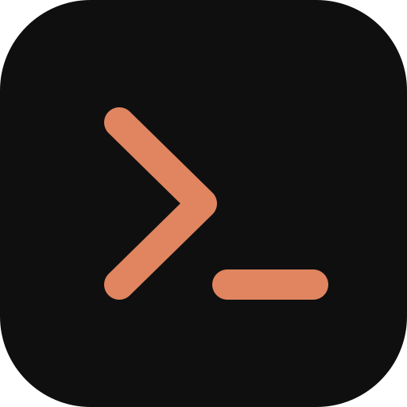

<div align="center">



# Claude Remote Control

**Drive Claude Code on your own machine from your phone — anywhere in the world.**

A small daemon runs on your computer. A PWA runs in your pocket. Together they
turn Claude Code into a chat app that can actually touch your files, run your
commands, and ask your permission before it does.

</div>

---

## What it does

- **Chat with Claude Code from your phone.** Real streaming output, the same
  `CLAUDE.md`, settings, MCP servers and skills your desktop uses.
- **Watch what it's doing.** Tool calls render as cards — the command it ran,
  the diff it wrote, the output it got — instead of a wall of text.
- **Approve permissions remotely.** When Claude wants to run something, your
  phone buzzes. Allow once, always allow, or deny — from the couch.
- **Send photos and screenshots.** Attach from the camera or gallery (or paste
  one on desktop); images are resized in the browser before they're sent.
- **See your desktop sessions.** Conversations started in Claude Desktop or the
  `claude` CLI show up read-only and update live. Tap **Take over** to continue
  one from your phone.
- **Reach it from anywhere via Tailscale.** No port forwarding, no public
  exposure, no cloud middleman. It also works on plain LAN IPs at home.
- **Installs like an app.** PWA on iOS, Android, macOS and Windows. Same UI
  scales up to a proper desktop panel with a session sidebar.

## Requirements

- **Node.js 20+**
- **Claude Code, logged in.** Run `claude` in a terminal once and sign in with
  `/login` — the daemon spawns Claude Code under your own account, so it needs
  credentials on the machine. (`ANTHROPIC_API_KEY` works too.)
  *Being signed into the Claude Desktop app is not enough on its own.*
- **Tailscale** (optional, for access outside your network)

## Quick start

```bash
git clone https://github.com/NspxMiguel/claude-remote-control.git
```

```bash
cd claude-remote-control && npm install && npm start
```

The daemon prints a QR code. Scan it with your phone, and you're paired:

```
  Open on your phone:

  █▀▀▀▀▀█ ▀▄█ ▄▀ █▀▀▀▀▀█
  █ ███ █ █▄▀█▀▄ █ ███ █
  ...

  http://your-mac.tail1234.ts.net:8787  (Tailscale — anywhere)
```

On the phone, use **Share → Add to Home Screen** to install it as a real app.

### Everyday commands

```bash
npx crc start
```

| Command | What it does |
| --- | --- |
| `crc start` | Run the daemon (default) |
| `crc pair` | Print a fresh pairing QR code |
| `crc status` | Addresses, Tailscale state, paired devices |
| `crc token --rotate` | New master token; revokes every paired device |
| `crc devices --revoke <id>` | Kick one lost phone |

### On a desktop

The same page is the desktop app — install it from the browser's address bar,
or just keep a tab open. Sessions live in a sidebar, code blocks have copy
buttons, and the tab title tells you when Claude needs you.

| Shortcut | Action |
| --- | --- |
| `⌘/Ctrl + K` | New session |
| `⌘/Ctrl + .` | Interrupt |
| `⌘/Ctrl + Enter` | Allow a pending permission |
| `⌘/Ctrl + Backspace` | Deny it |
| `Esc` | Close the open sheet |
| `Enter` | Send (a phone keyboard inserts a newline instead) |

## Reaching it from anywhere

Install [Tailscale](https://tailscale.com/) on your computer and your phone, sign
both into the same tailnet, and you're done — the daemon detects it and prints a
`*.ts.net` address that works from any network on earth.

```bash
tailscale up
```

Nothing is exposed to the public internet: the tailnet is a private network, and
the daemon still demands a token on top of it.

Without Tailscale you get LAN addresses (`http://192.168.x.x:8787`), which work
fine at home.

## Security

You are handing a device the ability to run commands as you. Treat the token
like an SSH key.

- **Every request needs a token.** The master token lives in
  `~/.claude-remote-control/config.json` (mode `600`). Phones get their own
  device tokens at pairing time, revocable one by one.
- **A paired device has full control of the machine.** It can run commands as
  you, so it can also read that config file. Per-device tokens exist so you can
  revoke one without rotating everything — they are hygiene, not a sandbox.
  Pair only devices you'd hand your unlocked laptop to.
- **Repeated bad tokens lock an address out** for five minutes.
- **Sessions are confined** to `allowedRoots` (your home directory by default).
  Path traversal out of them is refused.
- **Permission mode is yours to pick.** `default` routes every prompt to your
  phone. `bypassPermissions` asks nothing — only use it somewhere you'd be
  comfortable running `rm -rf` unattended.
- **Bind narrowly if you want.** `host: "127.0.0.1"` makes it local-only;
  your Tailscale IP makes it tailnet-only. The default `0.0.0.0` covers LAN
  and tailnet.

There is **no TLS**. Over Tailscale the tunnel is already encrypted end to end.
On a home LAN, traffic is in the clear — fine for most people, but don't run
this over coffee-shop Wi-Fi without Tailscale.

If you lose a phone:

```bash
npx crc token --rotate
```

## Configuration

`~/.claude-remote-control/config.json`:

```jsonc
{
  "port": 8787,
  "host": "0.0.0.0",           // 127.0.0.1 = local only
  "token": "…",                // master token
  "devices": [],               // paired phones
  "allowedRoots": ["/Users/you"],
  "defaultCwd": "/Users/you/code",
  "defaultModel": "sonnet",
  "defaultPermissionMode": "default",
  "permissionTimeoutSec": 600, // unanswered prompts are denied after this
  "maxFeedItems": 2000,
  "maxSessions": 8,            // each one is a Claude Code process
  "claudeExecutable": null     // set if `claude` lives somewhere unusual
}
```

`CRC_PORT`, `CRC_HOST` and `CRC_TOKEN` override the file, which is handy in a
service definition.

## Keeping it running

- **macOS** — edit and install `scripts/com.claude.remotecontrol.plist` into
  `~/Library/LaunchAgents`.
- **Linux** — edit and install `scripts/claude-remote-control.service` into
  `~/.config/systemd/user`.

Both files carry their own instructions in the comments.

## How it works

```
  phone (PWA)                     your machine
  ┌────────────┐   WebSocket    ┌──────────────────────────────┐
  │  chat UI   │◀──────────────▶│  daemon                      │
  │  approvals │   REST + WS    │   ├─ Agent SDK → claude code │
  └────────────┘                │   └─ tail ~/.claude/projects │
        ▲                       └──────────────────────────────┘
        └── Tailscale or LAN                 │
                                    Claude Desktop / CLI
                                    write transcripts here
```

Two ways in:

1. **Owned sessions** run through
   [`@anthropic-ai/claude-agent-sdk`](https://www.npmjs.com/package/@anthropic-ai/claude-agent-sdk).
   The daemon holds the conversation open, streams partial messages to your
   phone, and parks each `canUseTool` call until you answer it.
2. **Mirrored sessions** are read from the JSONL transcripts Claude Desktop and
   the CLI already write to `~/.claude/projects`. The daemon tails those files,
   so anything you start at your desk shows up on your phone within a second.
   Taking one over forks it into an owned session, which leaves the original
   transcript intact.

Feed items carry a monotonic sequence number, so a phone that drops off the
network resumes with `?since=<seq>` instead of refetching the conversation.

## Limitations

- **Notifications only fire while the app is open** (or recently backgrounded).
  There is no push server, by design — that would mean routing your data
  through someone else's infrastructure.
- **Interactive prompts inside a tool** (a shell command that asks a question)
  aren't forwarded; the tool will hang until it times out.
- **Mirrored sessions are read-only.** Writing into a transcript another process
  owns would corrupt it, so taking over forks instead.
- **Restarting the daemon ends live sessions.** They live in memory. The
  conversation itself is safe — it reappears under *On this machine*, and
  **Take over** picks it back up.
- **No TLS**, as described above.

## Development

```bash
npm test
```

97 tests covering the feed protocol, transcript parsing, auth, path
confinement, and the HTTP/WebSocket surface. No network or credentials needed:
session tests run against a fake Claude Code executable
(`test/fixtures/fake-claude.mjs`) that speaks the Agent SDK's control protocol,
so streaming, permission approval, denial, timeout and interrupts are all
exercised end to end.

```bash
npm run icons
```

Regenerates the PNG app icons from pure Node (no image libraries).

## License

MIT — see [LICENSE](LICENSE).
